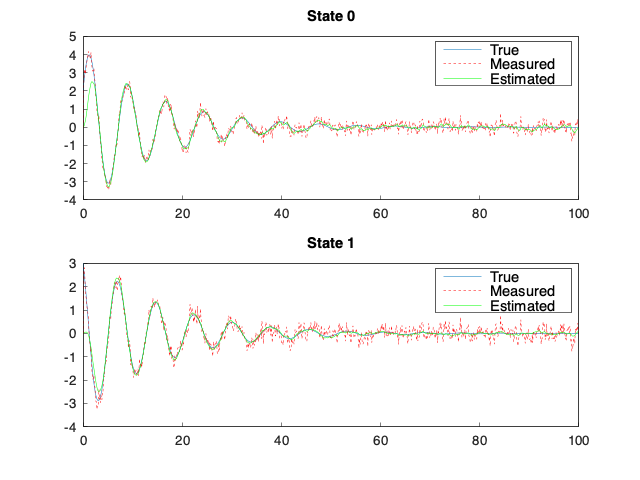

# ControlSystemSim
Practicing C++ by implementing a plant and closed-loop control system architecture. Used for other projects.

## Context 
Many real-life controlled systems can be modeled as a closed-loop control system where the plant represents the system (e.g., a mass-spring-dampener) and the supporting blocks measure its state parameters ([Sensor](https://github.com/gagandeepthapar/Sensor)), are estimated to reduce sensor error ([State Estimator](https://github.com/gagandeepthapar/StateEstimator)), are fed into a controller and compared to a reference signal ([Trajectory Generator](https://github.com/gagandeepthapar/TrajectoryGenerator)) where a control signal is outputted and fed into an actuator which applies a force to the plant whose subsequent response can be integrated ([State Integrator](https://github.com/gagandeepthapar/ODESolver)) and the cycle repeats. This architecture supports various plants such as standard linear time-invariant (LTI) systems, time-invariant systems, and non-linear systems.

An example of an uncontrolled Mass-Spring-Dampener System is plotted below with which employs sensors with pink-noise and a Kalman filter for estimation.



## Includes
Requires the `Eigen` C++ library which can be found [here](https://eigen.tuxfamily.org/index.php?title=Main_Page).
Also uses the `Matplot++` C++ library to plot data directly in C++ which can be found [here](https://github.com/alandefreitas/matplotplusplus/tree/master#line-plots). The required custom libraries are submodueld here. 
`CMake` and `make` are used also used to build the program.

## Running 
To run, clone the github in the directory of your choosing via 
```
git clone https://github.com/gagandeepthapar/ControlSystemSim
```


Ensure that the required libraries are installed. My system adds the `Eigen` and `Matplot++` headers directly in my include path so I don't have to explicity call it. You can either add the libraries in the same project directory or where you'd like (e.g., `usr/local/include`) and add them to your include path:
```
$ export CPLUS_INCLUDE_PATH="usr/local/include:$CPLUS_INCLUDE_PATH"
```


Once installed, you should be able to run the following commands in the project directory to setup the build directory and output, respectively:
```
$ cmake -S . -B build
$ make -C build
```


The output file should be called `example.out` which can be renamed directly in the `CMakeLists.txt` file.
